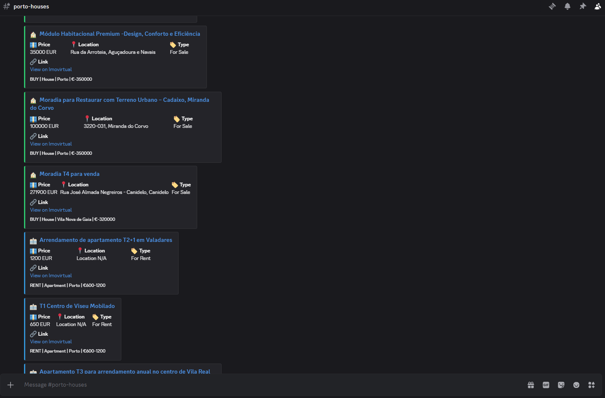
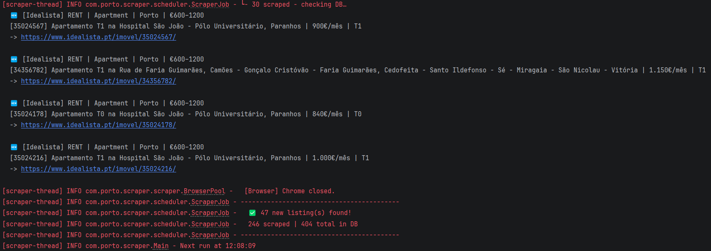
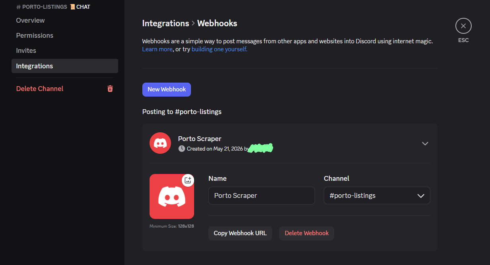

# 🏠 Porto Real Estate Scraper

> Never miss a listing again. A lightweight Java background service that watches Imovirtual and Idealista 24/7 and pings your Discord the moment something new appears.

---

## The Problem

Finding a house or apartment in the Porto district under optimal price conditions is genuinely brutal. The moment a good listing appears, it gets flooded with messages within the hour. If you rely on the official email alerts from Imovirtual or Idealista, you're already hours behind the people who refresh the page manually.

## The Solution

This scraper runs silently in the background, checking your saved searches every 5 minutes (configurable). The instant a listing appears that matches your criteria, you get a Discord notification on your phone with the direct link - before anyone else.

- **Imovirtual** - scraped via the embedded `__NEXT_DATA__` JSON (fast, no browser needed)
- **Idealista** - scraped via headless Chrome (Selenium), as JavaScript execution is needed due to Cloudflare 
- **SQLite database** - remembers every listing it's ever seen, so you only get notified once per listing
- **Discord webhook** - rich embed notifications with price, location, and a direct link
- **Config file** - change zones, prices and intervals without touching any code

---

## Screenshots

### Discord notification


### Console output


---

## Prerequisites

| Requirement | Version | Notes |
|---|---|---|
| Java (JDK) | 17 or higher | [Download](https://adoptium.net/) |
| Maven | 3.8+ | [Download](https://maven.apache.org/download.cgi) |
| Google Chrome | Any recent | Required for Idealista only |
| Discord account | - | Free, for notifications |

> **Chromedriver** is downloaded automatically by Selenium Manager on first run. You don't need to install it manually.

---

## Quick Start

### 1. Clone or download the project

```bash
git clone https://github.com/RafaelNTeixeira/PortoScraper.git
cd PortoScraper
```

Or just unzip the project folder if you downloaded it directly.

### 2. Configure your searches

Open `scraper.properties` (in the project root) and edit it to match what you're looking for:

```properties
# How often to check, in minutes
poll.interval.minutes=5

# Your Discord webhook URL (see setup guide below)
discord.webhook.url=https://discord.com/api/webhooks/YOUR_ID/YOUR_TOKEN

# Example: buy a house in Porto up to €350k on Imovirtual
target.1.source=IMOVIRTUAL
target.1.transaction=BUY
target.1.property=HOUSE
target.1.zone=PORTO
target.1.maxPrice=350000

# Example: rent an apartment in Matosinhos up to €1100/month on Idealista
target.2.source=IDEALISTA
target.2.transaction=RENT
target.2.property=APARTMENT
target.2.zone=MATOSINHOS
target.2.maxPrice=1100
```

### 3. Build

```bash
mvn clean package
```

### 4. Run

```bash
# Foreground (you can see the logs)
java -jar target/real-estate-scraper-1.0-SNAPSHOT.jar

# Background / invisible (Windows - keeps running after you close the terminal)
javaw -jar target/real-estate-scraper-1.0-SNAPSHOT.jar
```

To stop a background run: **Task Manager -> find `javaw.exe` -> End Task.**

---

## Setting Up Discord Notifications

You need to create a webhook in a Discord channel. It takes about 2 minutes.

### Step 1 - Create a channel

In your Discord server, create a private channel for alerts (e.g. `#porto-listings`). You can also use an existing channel or your own DMs via a private server.

### Step 2 - Open Integrations

Right-click the channel name -> **Edit Channel** -> **Integrations** -> **Webhooks** -> **New Webhook**.



### Step 3 - Copy the URL

Give the webhook a name (e.g. "Porto Scraper 🏠"), optionally set an avatar, then click **Copy Webhook URL**.

### Step 4 - Paste into scraper.properties

```properties
discord.webhook.url=https://discord.com/api/webhooks/1234567890/xxxxxxxxxxxxxxxxxxxxxxxxxxxx
```

Restart the scraper. The next time a new listing is found, a message will appear in your channel.

> **To get notifications on your phone:** make sure Discord mobile notifications are enabled for that channel. You'll get a push notification within seconds.

---

## Configuration Reference

### scraper.properties

| Key | Default   | Description |
|---|-----------|---|
| `poll.interval.minutes` | `5`       | How often to scrape. Lower = faster alerts, higher chance of rate limiting |
| `discord.webhook.url` | *(blank)* | Your Discord webhook. Leave blank to disable notifications |

### Search targets

Each target is defined by a set of `target.N.*` keys. `N` is any number - gaps are fine.

| Key | Required | Values |
|---|---|---|
| `target.N.source` | No | `IMOVIRTUAL` (default), `IDEALISTA` |
| `target.N.transaction` | **Yes** | `BUY`, `RENT` |
| `target.N.property` | **Yes** | `APARTMENT`, `HOUSE`, `LAND` |
| `target.N.zone` | **Yes** | See zone list below |
| `target.N.minPrice` | No | Minimum price in € |
| `target.N.maxPrice` | No | Maximum price in € |
| `target.N.minRooms` | No | Minimum bedrooms (1 = T1, 2 = T2 …) |
| `target.N.maxRooms` | No | Maximum bedrooms |
| `target.N.minArea` | No | Minimum area in m² |
| `target.N.maxArea` | No | Maximum area in m² |

### Available zones

| Zone key | Area |
|---|---|
| `PORTO` | Porto city centre |
| `MATOSINHOS` | Coastal, north of Porto |
| `GAIA` | South bank of the Douro |
| `MAIA` | North, near the airport |
| `GONDOMAR` | East of Porto |
| `VALONGO` | Northeast, generally cheaper |
| `POVOA_DE_VARZIM` | Northern coast |
| `VILA_DO_CONDE` | Northern coast, quieter |
| `BRAGA` | 50 min north, very affordable |
| `BARCELOS` | Rural Minho, budget option |

---

## How It Works

```
┌─────────────────────────────────────────────────────┐
│                  Scheduler (every 5 min)             │
└──────────────────────────┬──────────────────────────┘
                           │
          ┌────────────────┴────────────────┐
          │                                 │
   ┌──────▼──────┐                  ┌───────▼──────┐
   │  Imovirtual  │                  │   Idealista  │
   │   (Jsoup)    │                  │  (Selenium)  │
   │              │                  │              │
   │ Reads hidden │                  │   Launches   │
   │ __NEXT_DATA__│                  │   headless   │
   │ JSON in page │                  │ Chrome, for  │
   │              │                  │  JavaScript  │
   │              │                  │   execution  │
   └──────┬───────┘                  └──────┬───────┘
          │                                 │
          └────────────────┬────────────────┘
                           │
                  ┌────────▼────────┐
                  │  SQLite DB      │
                  │  (scraper.db)   │
                  │                 │
                  │  Already seen?  │
                  │  -> Skip         │
                  │  New listing?   │
                  │  -> Save + Alert │
                  └────────┬────────┘
                           │
                  ┌────────▼────────┐
                  │ Discord Webhook  │
                  │                 │
                  │ Rich embed with  │
                  │ price, location, │
                  │ direct link      │
                  └─────────────────┘
```

### Why two different scraping methods?

**Imovirtual** is built with Next.js. It embeds all its listing data as a JSON blob inside a hidden `<script>` tag on every page. Jsoup reads this directly without needing a browser - it's fast and reliable.

**Idealista** uses Cloudflare bot protection that serves a JavaScript challenge to any request that doesn't come from a real browser. Selenium launches an actual headless Chrome instance which executes the challenge, loads the full page and returns the rendered HTML for parsing.

---

## Running as a Persistent Background Service

### Windows

Create a file called `start-scraper.bat` next to the JAR:

```batch
@echo off
cd /d "%~dp0"
start "Porto Scraper" /B javaw -jar real-estate-scraper-1.0-SNAPSHOT.jar
echo Scraper started in background.
```

Double-click it to launch. To stop it: Task Manager -> Details tab -> find `javaw.exe` -> End Task.

### Linux / macOS

Create a simple systemd service or use `nohup`:

```bash
nohup java -jar real-estate-scraper-1.0-SNAPSHOT.jar > scraper.log 2>&1 &
echo $! > scraper.pid
```

To stop it:
```bash
kill $(cat scraper.pid)
```

---

## Viewing the Database

The scraper stores every listing it has seen in `scraper.db` (created automatically next to the JAR). You can inspect it with [DB Browser for SQLite](https://sqlitebrowser.org/) - free, no setup needed.

Useful queries:

```sql
-- All listings seen today
SELECT * FROM seen_listings WHERE seen_at >= date('now') ORDER BY seen_at DESC;

-- Count by source
SELECT source, COUNT(*) FROM seen_listings GROUP BY source;

-- Most expensive listings seen
SELECT title, price, location, source FROM seen_listings ORDER BY price DESC LIMIT 20;
```

To reset the database and start fresh (useful after significantly changing your filters):

```sql
DELETE FROM seen_listings;
```

---

## Troubleshooting

**No listings from Imovirtual**
- The `__NEXT_DATA__` JSON path may have changed. Check the console for `Listings array not found` errors.
- To inspect the raw JSON, set `DEBUG_FIRST_ITEM = true` in `ImovirtualScraper.java`, run once, and check the output.

**No listings from Idealista (403 or timeout)**
- Make sure Google Chrome is installed.
- Try increasing `poll.interval.minutes` - too-frequent requests can trigger rate limits.
- On first run, Selenium Manager downloads `chromedriver`. This requires internet access and may take ~30 seconds.

**Discord notifications not sending**
- Double-check the webhook URL in `scraper.properties` - it should start with `https://discord.com/api/webhooks/`.
- Make sure there are no extra spaces or line breaks around the URL.

**`scraper.properties` not being picked up**
- The file must be in the same directory as the JAR, not inside a subfolder.
- Check the console on startup: it logs exactly which config file was loaded and from where.

---

## Project Structure

```
real-estate-scraper/
├── scraper.properties              <- your config (edit this)
├── scraper.db                      <- auto-created SQLite database
├── pom.xml
└── src/main/java/com/porto/scraper/
    ├── Main.java                   <- startup & scheduler
    ├── config/
    │   ├── AppConfig.java          <- loads scraper.properties
    │   ├── SearchTarget.java       <- one search job (label + URL + source)
    │   └── UrlBuilder.java         <- builds Imovirtual & Idealista URLs
    ├── database/
    │   └── ListingRepository.java  <- SQLite deduplication
    ├── model/
    │   └── Listing.java            <- data class
    ├── notification/
    │   └── DiscordNotifier.java    <- Discord webhook client
    ├── scheduler/
    │   └── ScraperJob.java         <- one full scrape cycle
    └── scraper/
        ├── Scraper.java            <- common interface
        ├── BrowserPool.java        <- manages headless Chrome
        ├── ImovirtualScraper.java  <- Jsoup + __NEXT_DATA__ JSON
        └── IdealistaScraper.java   <- Selenium WebDriver
```

---

## Built With

- [Jsoup](https://jsoup.org/) - HTML fetching and parsing
- [Gson](https://github.com/google/gson) - JSON parsing
- [Selenium WebDriver](https://www.selenium.dev/) - headless Chrome automation
- [SQLite JDBC](https://github.com/xerial/sqlite-jdbc) - local database
- [SLF4J](https://www.slf4j.org/) - logging

All free and open source.

---

*Built to solve a real problem: finding a home in Portugal that matches the user's needs in this economy.*
